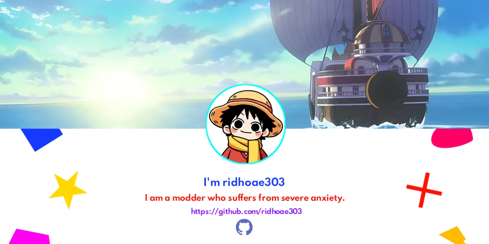

# 💫 About Me:

**I'm ridhoae303**, a modder who deals with severe anxiety.

Most of my projects are built entirely from a phone. No fancy setup, no multi-monitor workstation — just a smartphone, a lot of patience, and way too many hours spent debugging things that probably shouldn't have worked in the first place.

I enjoy reverse engineering, modding, Android internals, anti-tamper research, and building random ideas just to see if they can be pushed a little further.

## 🌐 Socials:
 
 
 

# ⭐ Character Favorite

## Miyoshi Takane 💕
### 三善タカネ 🌸

> *Favorite character from Blue Archive.*

---

## Monkey D. Luffy 🏴‍☠️
### モンキー・D ー・ルフィ 👒

> *From One Piece.*

# 💻 Tech Stack:

 
 
 
 
 
 
 
 
 
 
 
 
 
 
 
 
 
 
 
 
 
 
 
 
 
 
 
 
 
 
 

