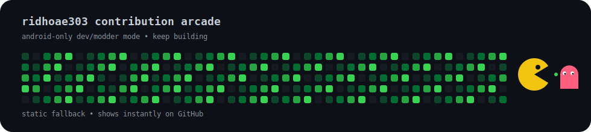

  

  # Hey, I'm ridhoae303 👋

  **Beginner Developer • Android-only Modder • Reverse Engineering Learner**

  No laptop. No PC. No desktop.  
  Just Android, patience, and a lot of trial-and-error.

  

    <a href="https://instagram.com/ridhoae303_">Instagram</a> •
    <a href="https://tiktok.com/@ridhoae303">TikTok</a> •
    <a href="mailto:ridhooffweb@gmail.com">Email</a>
  

---

## 💫 About Me

I'm **ridhoae303**, a beginner developer and modder who builds most of my stuff straight from an **Android phone**.

My setup is not fancy. I do not have a **laptop**, **PC**, or **desktop**. Going to an internet café? I would, but I do not have the money for that either. So yeah, I just use what I have and keep building anyway.

I like messing around with Android modding, reverse engineering, app internals, anti-tamper research, and random experiments that sometimes look impossible at first.

My projects may look rough, my tools may be simple, and my workflow may be messy, but that is part of the Android-only grind.

> Built from a phone. Powered by curiosity. Still learning, still breaking things, still fixing them.

---

## 🛠️ What I'm Into

- Android modding and app tinkering
- Reverse engineering experiments
- Android internals
- Anti-tamper research
- Small tools, patches, and random ideas
- Learning by trying, failing, fixing, and trying again

---

## 💻 Tech Stack

---

## 🟩 Pac-Man Contribution Arcade

  

---

## ⭐ Favorite Characters

  <table>
    <tr>
      <td align="center" width="50%">
        <h3>Miyoshi Takane</h3>
        
<strong>三善タカネ</strong>

        
        
<em>Favorite character from Blue Archive.</em>

      </td>
      <td align="center" width="50%">
        <h3>Monkey D. Luffy</h3>
        
<strong>モンキー・D・ルフィ</strong>

        
        
<em>From One Piece.</em>

      </td>
    </tr>
  </table>

---

### Android-only, but still building.

